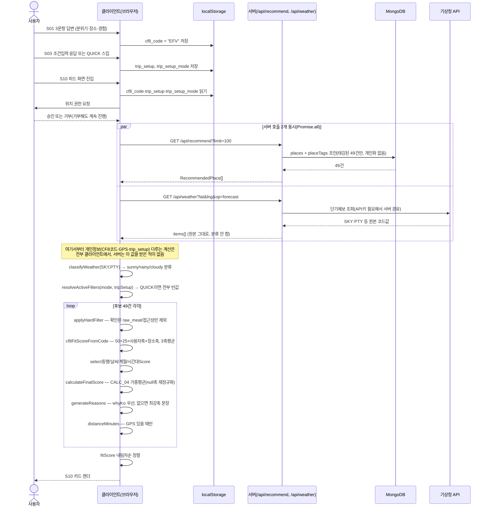

# FE-FEAT-005 추천엔진 — 실제 사용자 행동 기준 실행 흐름

S10 피드 화면 진입 시 실제로 무슨 일이 일어나는지, 어디서 계산되는지, 최종 화면에 뭐가 찍히는지 순서대로.

---

## 1. 전체 시퀀스



---

## 2. 단계별 — 어디서 실행되고 뭐가 오가는지

| 단계 | 실행 위치 | 입력 | 출력 |
|---|---|---|---|
| CF8 진단(S01) | 클라이언트 | 3문항 응답 | `cf8_code`(예 "EFV") → localStorage |
| 조건입력(S03) | 클라이언트 | 동행·이동제약·음식제약 | `trip_setup`, `trip_setup_mode` → localStorage |
| 후보 조회 | **서버** | `contentTypeId?`, `limit` (개인정보 없음) | 태깅된 49건 원본 데이터 |
| 날씨 조회 | **서버**(API키 때문) | `lat`, `lng` | SKY/PTY 원본 코드(분류 안 된 raw값) |
| 날씨 분류 | 클라이언트 | SKY, PTY | `"sunny"｜"rainy"｜"cloudy"` |
| 하드필터 | 클라이언트 | 49건 + `foodRestriction`/`walkingDifficulty` | 제외 후 45건(예: raw_meat 4건 제외) |
| CF8 축매칭 | 클라이언트 | `cf8_code` + 장소 3축 점수 | 0~100 매칭점수 |
| 상황보정 | 클라이언트 | 동행/날씨/계절/시간대 | 0~100 또는 null(데이터 없으면) |
| 최종점수 | 클라이언트 | 위 5개 성분 | `fitScore`(0~100) |
| 추천이유 | 클라이언트 | `whyKo` 또는 최강축 | `reasons: string[]` |
| 거리 | 클라이언트 | GPS 있을 때만 | `distanceMin`(표시 전용, 순위 무관) |
| 정렬 | 클라이언트 | 45건 각각의 fitScore | 내림차순 배열 |

---

## 3. 실제 실행 결과 (2026-09-05, 실제 서버·DB로 검증)

입력: `cf8Code="EFV"`, `mode="CUSTOM"`, `foodRestriction=["raw_meat"]`, `weather="sunny"`, `userLocation`=부산시청

```
총 45건 (raw_meat 하드필터로 4건 제외됨, 0건 잔존 확인)

1위. 해운대해수욕장(126081) — 83.3점 — 도보 100분
     이유: "1.5km 백사장을 끝까지 걸을 수 있습니다"
2위. 광안대교(127488) — 75.0점 — 도보 124분
     이유: "씨앗호떡은 그 자리에서 먹어야 합니다"
3위. 128164 — 75.0점 — 도보 76분
     이유: "해 진 뒤 조명이 들어옵니다"
```

## 4. S10 화면(`PlaceCard.tsx`)에 실제 찍히는 필드

| 화면 요소 | 소스 |
|---|---|
| 카드 이미지 | `firstImage`(TourAPI 원본, 서버가 그대로 전달) |
| 제목/영문명 | `title`/`titleEn` |
| **매칭 % "83% 잘 맞아요"** | `fitScore`(클라이언트 계산) |
| 설명 한 줄 | `reasons[0]`(클라이언트 계산) |
| "도보 O분" 또는 "거리 정보 없음" | `distanceMin`(GPS 있으면 숫자, 없으면 null → "거리 정보 없음") |
| 날씨 뱃지(실내/실내외/야외) | `weatherType`(원본 태깅값, 계산 아님) |
| 태그 라벨 | `tags`(현재 미구현, 빈 배열) |

**참고**: 카드가 실제로 이 값을 받으려면 소피의 `feed/page.tsx`가 `useRecommendations()` 훅을 호출하도록 바뀌어야 함(아직 미완료, 요청 발송됨).

---

## 5. 위치정보 원칙이 지켜지는 지점

`/api/recommend` 요청에 `cf8_code`/`trip_setup`/GPS 좌표가 **전혀 포함되지 않음** — 서버는 "어떤 사용자가 요청했는지"를 알 방법이 없고, 그저 "태깅된 장소 49건"을 누구에게나 똑같이 내려줄 뿐이다. 개인화(취향·위치·조건)는 그 응답을 받은 뒤 브라우저 안에서만 일어난다.
