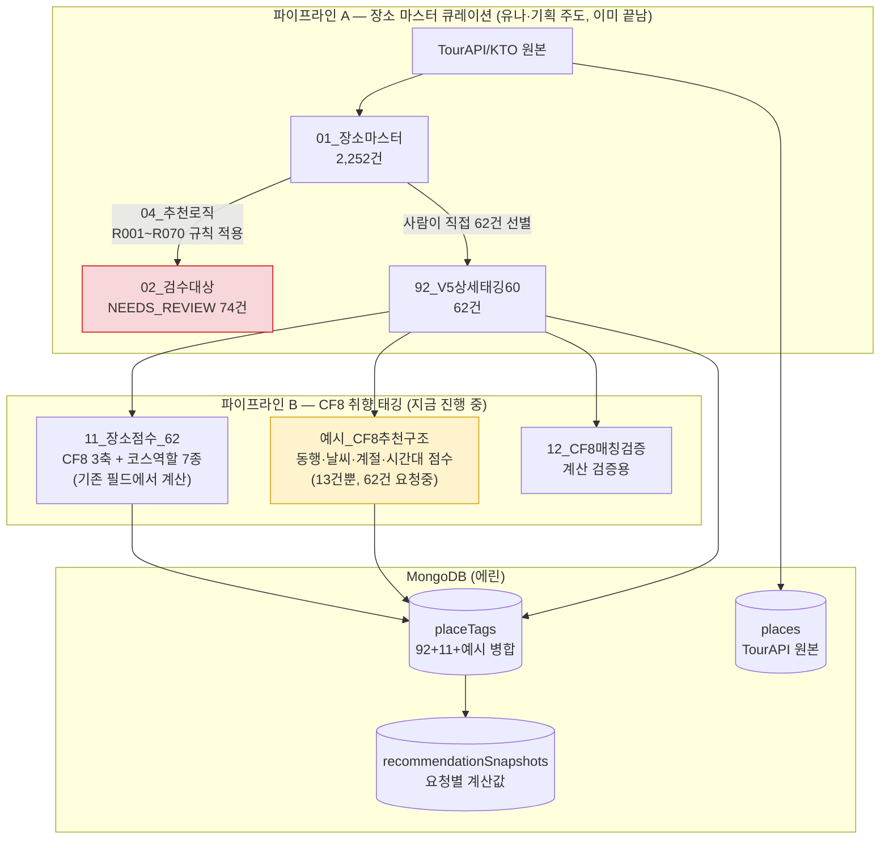
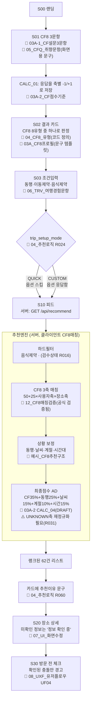

# 구글시트 — 유저플로우·로직 기준 설명

`docs/구글시트_데이터_감사.md`(탭별 상세)를 읽고 나서 "그래서 이게 실제로 언제 어떻게 쓰이는지" 그림으로 정리한 문서. 시트 28개를 두 종류로 나눠서 본다.

- **규칙서** — 사람이 읽고 코드로 옮기는 문서. DB에 안 들어감(계산식, 화면 정의, 하드필터 정의 등).
- **데이터 시트** — 실제 값이 들어있어서 DB로 임포트되는 원천.

---

## 1. 큰 그림 — 두 개의 파이프라인이 만난다

**핵심**: 92_V5상세태깅60(62건)은 이미 2,252건짜리 마스터에서 걸러진 "최종 후보"다. 우리 추천엔진은 이 62건 안에서만 순위를 매기지, 2,252건 전체를 다시 필터링하지 않는다 — 그래서 `04_추천로직`의 하드필터 규칙 대부분(R010~R019)이 우리 스코프 밖인 것.

---

## 2. 사용자 화면 흐름 — 어느 화면이 어느 시트/로직을 쓰는지

---

## 3. 데이터가 실제로 쓰이는 3개 맥락

### 맥락 1 — "이 장소가 후보에 들어갈 자격이 있나" (마스터 큐레이션, 이미 끝남)

`01_장소마스터`(2,252건) → `04_추천로직` 규칙(R010~R023: 비활성 제외, 소매점 제외, 좌표 품질, 노출등급 결정) → `service_status`(FEATURED/STANDARD/...) 결정 → 유나가 그중 62건을 `92_V5상세태깅60`으로 직접 큐레이션.

**우리가 지금 신경 쓸 부분**: 이 62건 중 `review_status`가 아직 `NEEDS_REVIEW`인 게 섞여있는지만 확인(R016). 나머지 규칙은 이미 반영된 결과물을 받는 입장이라 재구현 불필요.

### 맥락 2 — "이 장소가 어떤 성격인가" (CF8 취향 매칭용 고정 속성)

`92_V5상세태깅60`의 원시 필드(noise_level, local_depth, stay_minutes, category 등) → `11_장소점수_62`가 이걸 CF8 3축(-2~+2)과 코스역할 7종(0~100)으로 변환 → `placeTags`에 저장 → **사용자가 몇 번을 방문하든 안 바뀌는 값**(장소 자체의 성격).

`예시_CF8추천구조`의 동행유형·날씨·계절·시간대 점수도 같은 성격(장소가 "혼자 오기 좋은지" "비 오는 날 좋은지" 등 고정 속성) — 지금 13건뿐이라 62건 확장이 급함.

### 맥락 3 — "이 사용자에게 지금 이 장소가 맞는가" (요청마다 계산되는 개인화 점수)

사용자의 CF8 코드(S01에서 판정) + trip_setup(S03에서 입력) + 현재 시간·날씨·계절(서버가 자동 판단) → 맥락2의 고정 속성과 대조해서 `axis_match_score`(50+25×사용자축×장소축) 계산 → 최종점수 AD로 종합 → 랭킹.

이 계산 결과(`recommendationSnapshots`)는 **저장은 하되 누적 안 함** — 같은 사용자가 다시 요청하면 최신값으로 덮어씀. 장소의 성격(맥락2)과 달리 이건 "이 순간, 이 사용자"에게만 유효한 값이라서 그렇다.

---

## 4. 규칙서 vs 데이터 시트 — 다시 봐도 헷갈릴 때 이 표로

| 종류 | 시트 | 코드로 뭘 하나 |
|---|---|---|
| **규칙서(문서로만 참고)** | 03A-4(하드필터), 03A-2(계산식), 03B/03C(시나리오), 04_추천로직, 04_CF8_유형, 99_코드사전, 10_속성사전_v1 | 사람이 읽고 `src/lib/`에 함수·상수로 직접 구현. DB에 안 들어감 |
| **화면 문구(프론트가 참고)** | 05_CFQ_취향문항, 06_TRV_여행경험문항, 07_UI_화면수정, 08_UXF_유저플로우, 03A_CF8프로필 | 소피가 화면 텍스트·흐름 구현할 때 참고. DB에 안 들어감 |
| **실데이터(임포트 대상)** | 92_V5상세태깅60, 11_장소점수_62, 예시_CF8추천구조 | `placeTags` 컬렉션으로 그대로 적재 |
| **마스터/검수(참고, 지금 스코프 밖)** | 01_장소마스터(+_수정), 02_검수대상 | `placeMaster` 만들 때(나중) 소스, 지금은 미사용 |
| **검증용(임포트 안 함)** | 12_CF8매칭검증 | 공식이 맞는지 확인하는 용도로만 씀, 이미 다 확인함 |
| **레거시(무시)** | 90/91/93(숨김), 03_추천시나리오(구) | CF8 전환 전 자료, 참고 안 함 |
